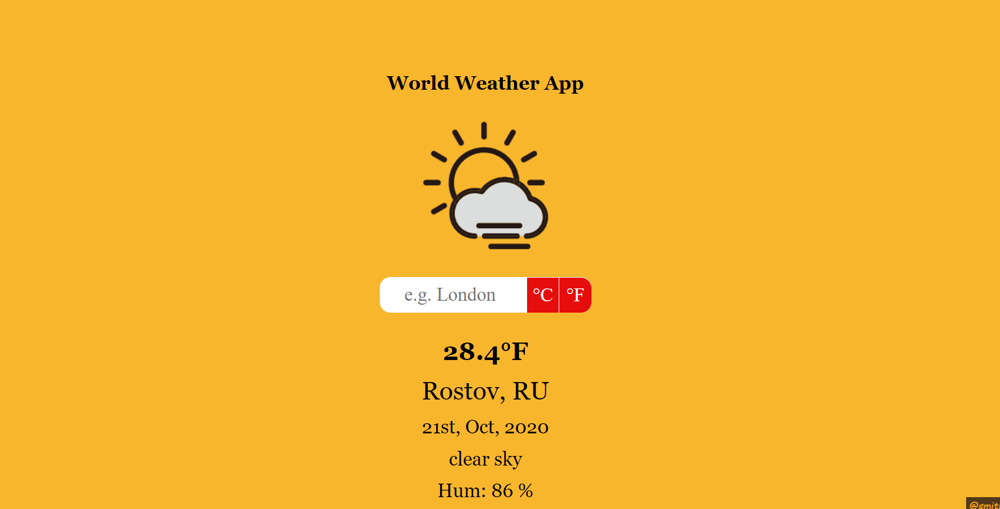

## Weather App
  This is my implementation of the odin project weather app assignment.

  ## Preview
|                |
|----------------|
||

## Live Version
  - The project is hosted [here](https://smithvyne.github.io/WorldWeatherApp/)

## Technologies
  - [Webpack](https://webpack.js.org/)
  - [Date fns module](https://date-fns.org/)
  - Javascript
  - HTML
  - CSS

## Installation
Follow the steps below to test the project locally. First ensure you have a version of [Node.js](http://nodejs.org/) equal or greater than v6.10.0 installed.

1. Clone the repository from a terminal `https://github.com/SmithVyne/WorldWeatherApp.git` and cd into the directory.
3. Install project dependencies by running `npm install`
4. Run `npm run webpack` to compile a development build.
5. Run `npm run start` to serve the project live on `http://localhost:9000` and voila!!!.

👤 **Smith Nkereuwem**

- Github: [@SmithVyne](https://github.com/SmithVyne)
- Twitter: [@SmithVyne](https://twitter.com/SmithVyne)
- Email: [email me](smithnkereuwem2@gmail.com)

## Show your support

Give a ⭐️ if you like this project!
